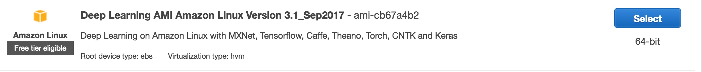
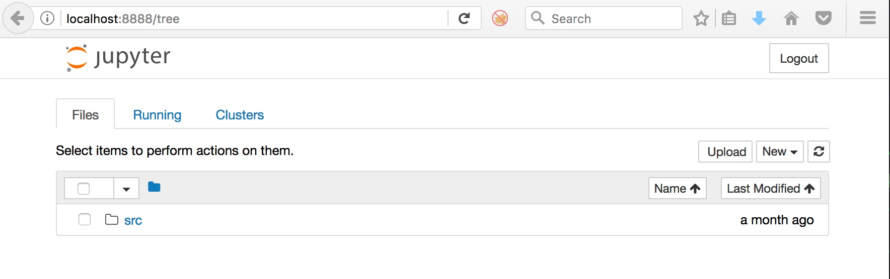
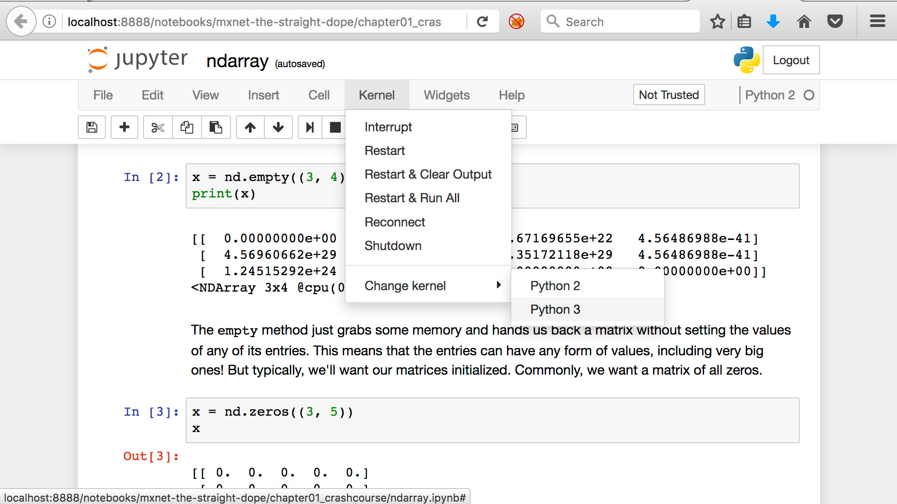
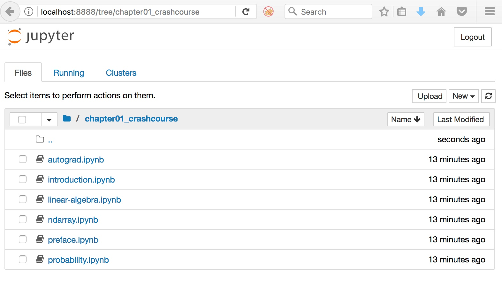
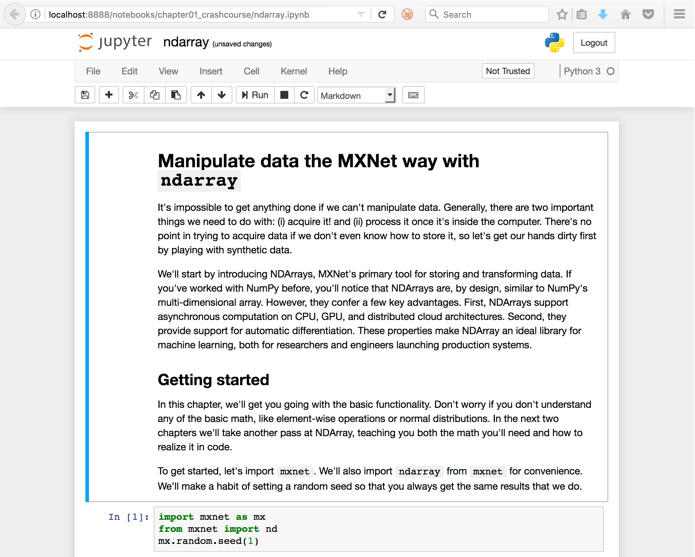
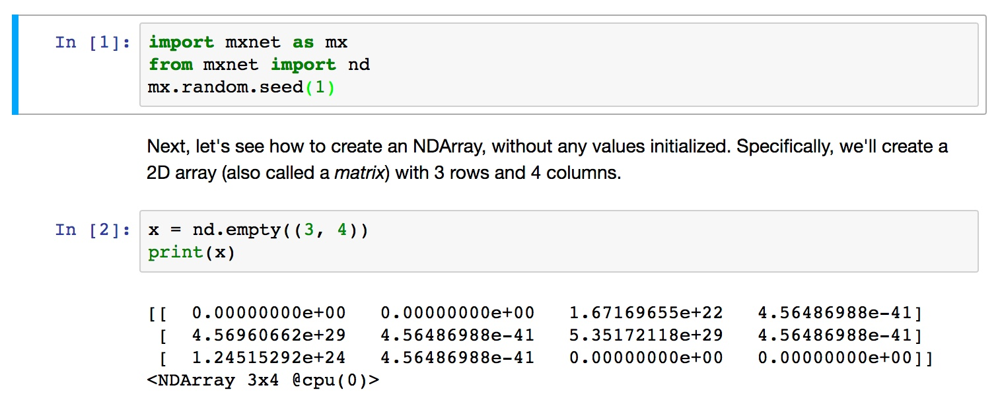

# Preparation for Deep Learning practical session


## Contents
1.  [Instructions](#instructions)
2.	[Set up the EC2 environments](#ec2env)
3.  [Validate the remote installation](#remotevalidate)


## Instructions <a name="instructions"></a>
This document describes the setup for the Deep Learning workshop. There are several tasks for you to complete in preparation:    
**0. Check/increase EC2 instance limits**   
**2. Set up the EC2 Deep Learning environment on a CPU instance type (c4.4xlarge)**  
**3. Set up the EC2 Deep Learning environment on a GPU instance type (p2.xlarge)**

## Check/increase EC2 instance limits
Ensure you have the ability to spin up the particular instance types. For the purpose of this workshop, you will require 1x CPU instance type and 1x GPU instance type. To check your EC2 limits, go to the EC2 console and click the 'Limits' link on the left hand side. You will then see a list of your on-demand EC2 instance limits. Scroll down the list until you find the p2.xlarge instance type and ensure the value is at least one (1) or greater.

# Preparing the Deep Learning AMI environments on EC2 <a name="ec2env"></a>

For the Deep Learning environment we are going to be using a CPU-based host (c4.xlarge) and also a GPU-based host (p2.xlarge) to demonstrate the difference between the two instance types. You need to set up **both a CPU and a GPU host** based on the below configuration. Note the extra step for the GPU instance type but otherwise the setup is the same.

**Step 1:** Launching the compute instance
- Open the [AWS Console](https://console.aws.amazon.com/console/home)
- Select `eu-west-1` as the region
- Choose EC2 from the list of services
- Click the 'Launch Instance' button.
- From the Quick Start AMI selection, choose `Deep Learning AMI Amazon Linux Version 3.1_Sep2017` and press Select



- Select the c4.xlarge instance type if running the CPU instance type

- Alternatively select the p2.xlarge if running the GPU instance type


- Click the 'Review & Launch' button at the bottom of the screen
- Review the settings and ensure you are happy with the selection. We can leave the defaults for the workshop
- Select the 'Launch' button and either select an existing Key Pair or create a new one so you can log into the host
- Select 'Launch Instance'

**Step 2:** Setting up the instance

During the workshop, you will be securely accessing the Jupyter notebook server on your host and will therefore need to map port `8888` (default Jupyter notebook port) to your local machine in order to connect via the browser. This is accomplished via the `ssh -L` command.

1. Identify the instance and the public DNS / IP address associated with it.

2. Once the status checks have completed, open a terminal and ssh to host, replacing the host address and private key with your own.
```
ssh -L 8888:localhost:8888 -i <YOUR PRIVATE KEY> ec2-user@<YOUR INSTANCE ADDRESS>
```

3. Change to the MXNet directory, and clone the Gluon tutorials.
```
cd ~/src/mxnet
git clone https://github.com/zackchase/mxnet-the-straight-dope.git
git clone https://github.com/herbertjkelly/MXNetDemoPre.git
```

**Step 3:** GPU-only - install CUDA 8.0 support for MXNet.
```
sudo pip3 install mxnet-cu80 --pre
```

***Ensure you have repeated the above for both CPU and GPU environments***

## Validate the EC2 installation <a name="remotevalidate"></a>

1. Log on via SSH to the instance (see Step 2.2 above) and start the Jupyter Notebook server (there will be a pause the first time this is run.)
```
jupyter notebook
```

2. Copy/Paste the URL shown in your terminal into your browser to access the notebook.


3. Ensure you are using the Python 3 Kernel.


4. Verify MXNet is installed and working as expected:

- Navigate to the `mxnet-the-straight-dope/chapter01_crashcourse` directory:


- Open the `ndarray.ipynb` notebook


- Run the first two blocks of code by clicking on the cells and pressing 'Shift+Enter' on each. You should see the following output:


**Congratulations, your EC2 environment is ready to go!**
